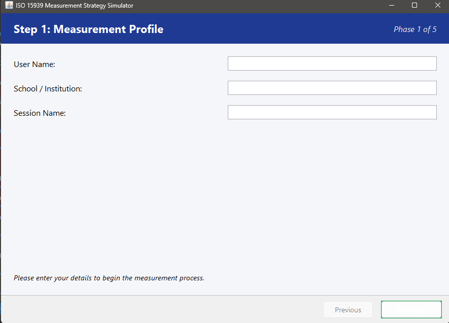

# ISO 15939 Measurement Process Simulator

**Student Name:** Yiğit Zümbüloğlu  
**Student ID:** 202428057

---

## Prerequisites
- **Java Development Kit (JDK) 17** or later must be installed on your system.
- Ensure that `javac` and `java` commands are available in your system's PATH.

## Project Structure
- `src/main/java`: Contains the source code organized into MVC packages.
  - `com.simulator.model`: Logic and data structures.
  - `com.simulator.view`: Swing UI components and panels.
  - `com.simulator.controller`: Glue between model and view.
- `bin/`: Directory for compiled `.class` files.
- `screenshot.png`: A visual demonstration of the application.

## Detailed Compilation Instructions
1. Open your terminal or Command Prompt.
2. Navigate to the project root directory.
3. Create a `bin` directory if it doesn't already exist:
   ```bash
   mkdir bin
   ```
4. Execute the following command to compile all source files:
   ```bash
   javac -d bin -sourcepath src/main/java src/main/java/com/simulator/Main.java
   ```

## Detailed Run Instructions
1. After successful compilation, start the application by running:
   ```bash
   java -cp bin com.simulator.Main
   ```
2. The application window **"ISO 15939 Measurement Strategy Simulator"** will appear.

## Using the Application
The simulator follows a 5-phase wizard process:
1. **Profile**: Input operator information and institutional context.
2. **Define**: Configure the Operating Context and select a Target Scenario.
3. **Plan**: Review the Structured Measurement Strategy (metrics and aspects).
4. **Collect**: Input actual measurement data. The system generates indexed results (1-5) in real-time.
5. **Analyse**: Examine the Spider Graph, aggregate weighted indices, and the Strategic Gap Analysis.

---

## Screenshot Demonstration
Below is a visual demonstration of the application in action:



---

## Notes
- The application uses **Java Swing** for the graphical interface and **Graphics2D** for custom chart rendering.
